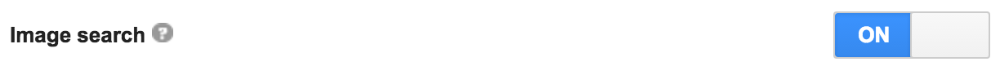

# Get Images from Google Search in Python
Module to Search for Images using 'Google Search API'

##This project is a python approach of [Vadim Demedes](https://vadimdemedes.com)[ google-images project](https://travis-ci.org/vadimdemedes/google-images.svg?branch=master)

#### I got a little bit of his documentation and adapted below, check it out and feel free to fork, clone, etc

## Usage

**Note**: You'll need to [set up your own Google Custom Search Engine](#set-up-google-custom-search-engine) to execute queries.

```python
from Client import Client

client  = Client('CSE ID', 'API KEY')
options = {
    'page':"",
    'size':"large",
    'type':"",
    'dominantColor':"",
    'colorType':"",
    'safe':"high"
}

client.search('Steve Jobs', options)

""" 
# Example on the jSON structure that comes from .search() call

{'displayLink': 'www.funnyordie.com',
 'fileFormat': 'Image Document',
 'htmlSnippet': 'Leaked Apple Memo: <b>Steve Jobs</b> ...',
 'htmlTitle': 'Leaked Apple Memo: <b>Steve Jobs</b> Critiques Tim Cook&#39;s '
              'Liver from News ...',
 'image': {'byteSize': 36996,
           'contextLink': 'http://www.funnyordie.com/articles/177ae91679/leaked-apple-memo-steve-jobs-critiques-tim-cook-s-liver',
           'height': 640,
           'thumbnailHeight': 137,
           'thumbnailLink': 'https://encrypted-tbn0.gstatic.com/images?q=tbn:ANd9GcR-hJViM9ncF6wHhyd2XkvPl_v1uElFYuS4V3vWhfDxUgbdIqzI18CFqU7u',
           'thumbnailWidth': 137,
           'width': 640},
 'kind': 'customsearch#result',
 'link': 'http://www.funnyordie.com/thumbnails/177ae91679/fullsize',
 'mime': 'image/',
 'snippet': 'Leaked Apple Memo: Steve Jobs ...',
 'title': "Leaked Apple Memo: Steve Jobs Critiques Tim Cook's Liver from News "
          '...'}
"""
```

## API

Please see Google's [API documentation](https://developers.google.com/custom-search/json-api/v1/reference/cse/list#parameters) for details on the option and response properties and their possible values. Note that the option names used here may differ slightly (e.g. no `img` prefix).

### Client(engineId, apiKey)

#### engineId

Type: `string`

The [identifier](https://developers.google.com/custom-search/json-api/v1/overview#prerequisites) for a Custom Search Engine to use.

#### apiKey

Type: `string`

The [credentials](https://support.google.com/googleapi/answer/6158857?hl=en) for accessing Google's API.

### Instance

#### .search(query, option)

Perform an image search for `query`.

##### query

Type: `string`

The search terms to use for finding images. Identical to those you would use in a web search.

##### option

Type: `object`

###### page

Type: `number`<br>
Default: `1`

The range of results to return. Useful because often results cannot be returned in a single response. Note that it is a one-based unsigned integer. E.g. page `1` has the first 10 results, page `2` has the next set of 10, etc.

###### size

Type: `string`

The size of images to search. E.g. `medium` or `xxlarge`.

###### type

Type: `string`

The category of images to search. E.g. `face` or `photo`.

###### dominantColor

Type: `string`

The [dominant color](https://designshack.net/articles/graphics/understanding-color-dominant-vs-recessive-colors/) to search for. E.g. `yellow` or `purple`.

###### colorType

Type: `string`

The category of color spectrums to search. E.g. `gray` or `color`.

###### safe

Type: `string`

The heuristic level to use for filtering out explicit content using [SafeSearch](https://en.wikipedia.org/wiki/SafeSearch). E.g. `off` or `high`.

### Download Images

#### .download_photo(folder, url)
Download image based on given url and folder path to store the data

##### folder

Type: `string`

The folder that the image will be stored. E.g `/Desktop/<folder-name>`

##### url

Type: `string`

String URL related to the image on internet. To get image url is like this:
 ```client.search('Steve Jobs', options)[0]['image']['contextLink'] ```

## Set up Google Custom Search Engine

Google deprecated their public Google Images API, so to search for images you need to sign up for Google Custom Search Engine.
Here are the steps you need to do:

### 1. Create a Google Custom Search Engine

You can do this here: [https://cse.google.com/cse](https://cse.google.com/cse).

Do not specify any sites to search but instead use the "Restrict Pages using Schema.org Types" under the "Advanced options".
For the most inclusive set, use the Schema: `Thing`. Make a note of the CSE ID.

### 2. Enable Image Search

In your search engine settings, enable "Image search":



### 3. Set up a Google Custom Search Engine API

Register a new app and enable Google Custom Search Engine API here: [Google Developers Console](https://console.developers.google.com).
Make a note of the API key.

